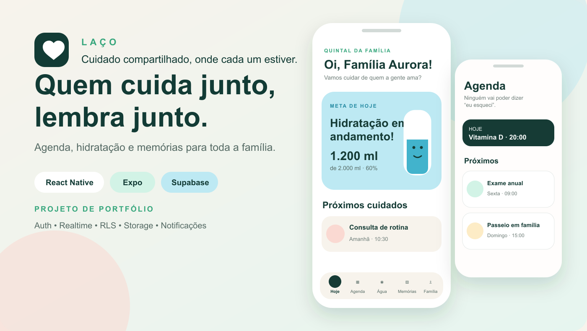
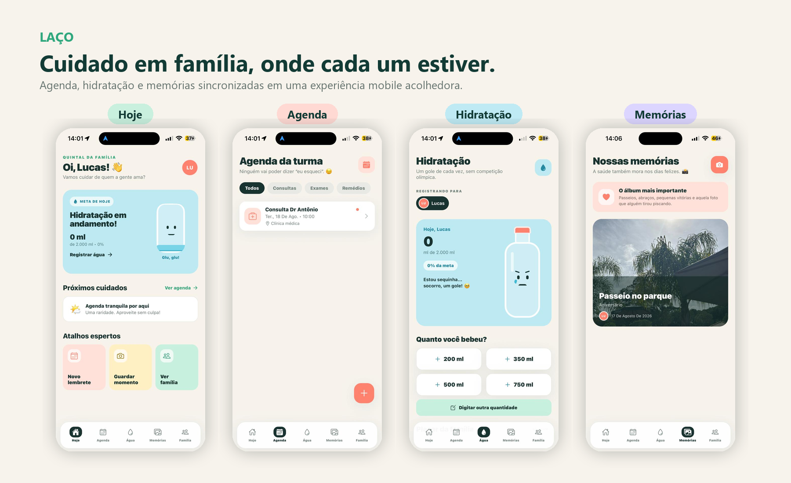
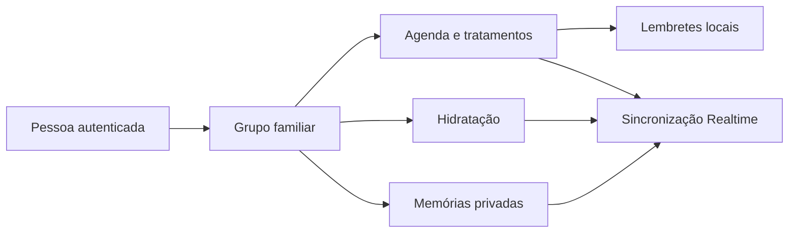
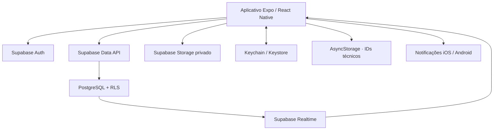

# Laço — cuidado em família, onde cada um estiver




Aplicativo mobile para famílias organizarem consultas, exames, medicamentos, hidratação e memórias em um único espaço compartilhado. O Laço nasceu de uma necessidade real: reduzir esquecimentos e tornar o cuidado cotidiano mais leve, colaborativo e humano.

> **Status:** MVP funcional em evolução, desenvolvido como projeto de portfólio. Não é um dispositivo médico e não substitui orientação profissional.

## Visão geral

O Laço reúne agenda médica, tratamentos recorrentes, hidratação e fotografias em uma experiência única para iOS e Android. Cada pessoa possui seu próprio login, entra em uma família por convite e recebe as atualizações compartilhadas pela internet.

### Produto em funcionamento



Capturas feitas em um iPhone durante os testes do MVP. Telas com código de convite e informações de acesso foram excluídas do material público.

### Destaques técnicos

- React Native, Expo SDK 54 e TypeScript estrito.
- Supabase Auth, PostgreSQL, Row Level Security, Realtime e Storage privado.
- Agenda de consultas, exames, medicamentos e outros cuidados.
- Tratamentos com duração, intervalo de horas e opção contínua.
- Notificações locais de eventos, medicamentos e hidratação.
- Garrafinha animada com evolução visual conforme o consumo de água.
- Memórias fotográficas armazenadas em bucket privado.
- Sessão móvel protegida pelo Keychain/Keystore e dados familiares lidos diretamente da nuvem.
- Interface autoral com animações, feedback tátil e linguagem acolhedora.

## O problema

Informações de saúde da família costumam ficar espalhadas entre conversas, calendários, papéis e aplicativos individuais. Isso dificulta a colaboração, especialmente quando uma pessoa ajuda a acompanhar consultas ou tratamentos de outra.

## A solução

O Laço cria um espaço privado por família. Integrantes autenticados visualizam a mesma agenda, acompanham a hidratação do grupo e guardam memórias, enquanto as políticas do banco impedem o acesso de pessoas externas àquela família.



## Fluxo principal

1. A primeira pessoa cria uma conta e um grupo familiar.
2. O Laço gera um convite temporário, revogável e válido para uma entrada.
3. Cada familiar cria seu próprio acesso e entra no grupo.
4. Agenda, água e memórias passam a ser sincronizadas pelo Supabase.
5. Cada celular agenda localmente os lembretes disponíveis após sincronizar.

## Arquitetura



Mais detalhes estão em [docs/ARCHITECTURE.md](docs/ARCHITECTURE.md).

## Segurança e privacidade

- Todas as tabelas compartilhadas usam Row Level Security.
- O acesso é condicionado à participação autenticada na família.
- Fotografias ficam em bucket privado e usam URLs assinadas temporárias.
- Convites expiram em 24 horas, funcionam uma vez, podem ser revogados e têm limitação de tentativas.
- Membros comuns não recebem o segredo do convite; somente a pessoa administradora o gerencia.
- O app não mantém consultas, notas, hidratação ou fotografias em cache persistente.
- A chave `service_role` nunca é utilizada pelo aplicativo.
- Variáveis locais são ignoradas pelo Git.
- Dados demonstrados neste repositório são fictícios.

O MVP ainda possui limitações de produção documentadas no [roadmap](docs/ROADMAP.md), incluindo exclusão integral de conta e notificações remotas. Consulte também [PRIVACY.md](PRIVACY.md) e [SECURITY.md](SECURITY.md).

## Decisões de produto

- A meta inicial de 2.000 ml representa um hábito configurado pelo MVP, não uma prescrição.
- O aplicativo não diagnostica, recomenda doses nem oferece aconselhamento médico.
- As mensagens usam humor leve, preservando o cuidado como assunto principal.
- Dados familiares exigem conexão; o app deliberadamente não persiste um snapshot médico no aparelho.
- Notificações de outros familiares só são agendadas depois que o aparelho sincroniza os eventos.

## Executar localmente

### Requisitos

- Node.js 22 ou superior.
- pnpm 11.19.0.
- Expo Go compatível com o SDK ou um development build.
- Projeto gratuito no Supabase.

### Instalação

```bash
git clone https://github.com/Lucas-Bonatto/laco-familia.git
cd laco-familia
pnpm install
```

Copie `.env.example` para `.env.local` e preencha somente as credenciais públicas:

```dotenv
EXPO_PUBLIC_SUPABASE_URL=https://seu-projeto.supabase.co
EXPO_PUBLIC_SUPABASE_PUBLISHABLE_KEY=sua-chave-publicavel
```

Inicialize o banco local pelas migrations versionadas e inicie o aplicativo:

```bash
pnpm dlx supabase@2.117.0 start
pnpm dlx supabase@2.117.0 db reset
pnpm start
```

Para um projeto remoto, use `supabase link --project-ref <id>` e revise `supabase db push --dry-run` antes de executar `supabase db push`.

Nunca adicione `service_role`, secret key ou credenciais administrativas ao aplicativo.

## Qualidade

```bash
pnpm typecheck
pnpm test
pnpm export:check
pnpm run doctor
pnpm dlx supabase@2.117.0 test db
pnpm dlx supabase@2.117.0 db lint --local --level warning --fail-on error
```

O workflow do GitHub executa verificação de tipos, testes unitários, exportação Android, recriação do banco, testes pgTAP e lint SQL em cada pull request e push para `main`.

## Estrutura do projeto

```text
App.tsx                         entrada, sessão e navegação
src/screens/                    Hoje, Agenda, Água, Memórias e Família
src/state/AppContext.tsx        estado compartilhado e sincronização
src/services/cloud.ts           operações do Supabase e fotos privadas
src/services/notifications.ts  agendamento e abertura de notificações
src/services/storage.ts        IDs técnicos de notificações e limpeza de legado
src/utils/medication.ts        regras de tratamentos recorrentes
src/components/                componentes visuais e interações
tests/                          testes unitários sem dependências extras
supabase/migrations/            histórico executável do banco
supabase/tests/                 testes adversariais de RLS e convites
docs/                           arquitetura, roadmap e materiais do projeto
```

## Distribuição

O código pode ser estudado e executado gratuitamente, mas GitHub, EAS Update, Expo Go e lojas de aplicativos são etapas diferentes. O Expo Go é usado aqui para desenvolvimento; uma distribuição pública confiável exige um build apropriado e o atendimento às regras de cada plataforma.

O projeto já está vinculado a uma conta EAS. Forks devem remover ou substituir `owner`, `extra.eas.projectId` e `updates.url` no `app.json` antes de vincular seu próprio projeto.

## Roadmap

- [x] Autenticação e grupos familiares.
- [x] Agenda compartilhada e medicamentos recorrentes.
- [x] Hidratação, animações e memórias privadas.
- [x] Realtime, sessão segura no aparelho e políticas RLS.
- [x] Verificação de tipos, testes iniciais e CI.
- [ ] Exclusão completa de conta, família e arquivos.
- [x] Convites temporários, revogáveis, de uso único e com rate limit.
- [ ] Administração de membros e trilha de alterações.
- [ ] Push remoto para lembretes criados por outros familiares.
- [ ] Edição e correção de eventos, água e memórias.
- [ ] Auditoria de acessibilidade com VoiceOver e TalkBack.

Consulte o plano completo em [docs/ROADMAP.md](docs/ROADMAP.md).

## Contribuição e licença

Contribuições devem seguir [CONTRIBUTING.md](CONTRIBUTING.md). Questões de segurança devem ser tratadas conforme [SECURITY.md](SECURITY.md), sem publicação de dados pessoais em issues.

Distribuído sob a licença MIT. Consulte [LICENSE](LICENSE).
