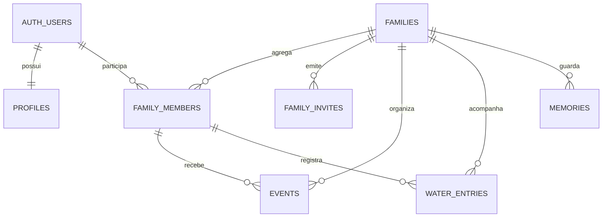

# Arquitetura do Laço

Este documento descreve as decisões atuais do MVP e deixa explícitos os limites que ainda precisam ser resolvidos antes de uma distribuição pública.

## Componentes

| Camada | Tecnologia | Responsabilidade |
| --- | --- | --- |
| Aplicativo | React Native + Expo | Interface, navegação e integração com recursos do aparelho |
| Estado | React Context | Sessão, snapshot familiar, sincronização e ações compartilhadas |
| Autenticação | Supabase Auth | Cadastro, login e persistência de sessão |
| Dados | Supabase Data API + PostgreSQL | Famílias, membros, eventos, água e metadados de memórias |
| Autorização | PostgreSQL Row Level Security | Restringir cada registro aos integrantes da família correta |
| Tempo real | Supabase Realtime | Notificar aparelhos abertos sobre alterações compartilhadas |
| Arquivos | Supabase Storage | Fotografias privadas organizadas por família |
| Sessão local | Expo SecureStore | Proteger tokens no Keychain/Keystore do aparelho |
| Estado técnico | AsyncStorage | IDs e impressões opacas para reconciliar notificações |
| Alertas | expo-notifications | Lembretes locais do aparelho |

## Modelo de dados

Eventos e hidratação usam chaves estrangeiras compostas para impedir que o integrante selecionado pertença a outra família.

## Autorização

O aplicativo utiliza somente a URL pública e a publishable key do Supabase. As políticas RLS consultam a participação do usuário autenticado na família antes de autorizar leitura ou alteração.

As operações privilegiadas de criação, entrada e gestão de convites ficam em funções privadas com `SECURITY DEFINER`, `search_path` vazio e permissão de execução limitada. Convites são segredos temporários de uso único; somente o proprietário os consulta ou revoga. A `service_role` não pertence ao cliente móvel.

## Sincronização

1. O aplicativo autentica a pessoa.
2. Um snapshot inicial é carregado do Supabase.
3. O snapshot permanece somente na memória do processo.
4. O Realtime solicita uma nova leitura quando alguma tabela compartilhada muda.
5. A interface recebe o snapshot mais recente; ao sair, o estado em memória e resíduos legados são apagados.

Dados familiares exigem conexão. Essa escolha evita persistir no AsyncStorage consultas, medicamentos, notas e URLs de fotografias; alterações feitas offline não entram em fila.

## Notificações

Os lembretes atuais são locais. Cada aparelho precisa abrir o Laço e sincronizar para conhecer eventos criados por outra pessoa. Depois disso, o próprio sistema operacional agenda as ocorrências.

Uma versão de produção deverá combinar notificações locais com push remoto e processamento no backend, garantindo entrega sem depender da abertura recente do aplicativo.

## Fotografias

O app envia a imagem para um bucket privado e grava no banco somente o caminho do objeto e seus metadados. A leitura usa URL assinada com validade de cinco minutos. A exclusão completa ainda precisa coordenar a linha do banco e o objeto do Storage.

## Decisões e compromissos

- React Context evita uma dependência adicional no tamanho atual do MVP.
- Um snapshot em memória simplifica a primeira versão, mas deverá dar lugar a paginação e atualizações incrementais.
- Expo acelera o desenvolvimento multiplataforma, mas Expo Go não é o canal final de distribuição.
- RLS mantém a autorização próxima aos dados, mas exige testes automatizados com famílias adversárias.

## Riscos conhecidos

- Ausência de exclusão integral de conta e arquivos.
- Notificações de saúde potencialmente visíveis na tela bloqueada.
- Reagendamento local dependente de sincronização do aparelho.
- Falta de trilha de auditoria para alterações familiares.
- Ausência de paginação e fila offline.

Esses itens estão priorizados em [ROADMAP.md](ROADMAP.md).
